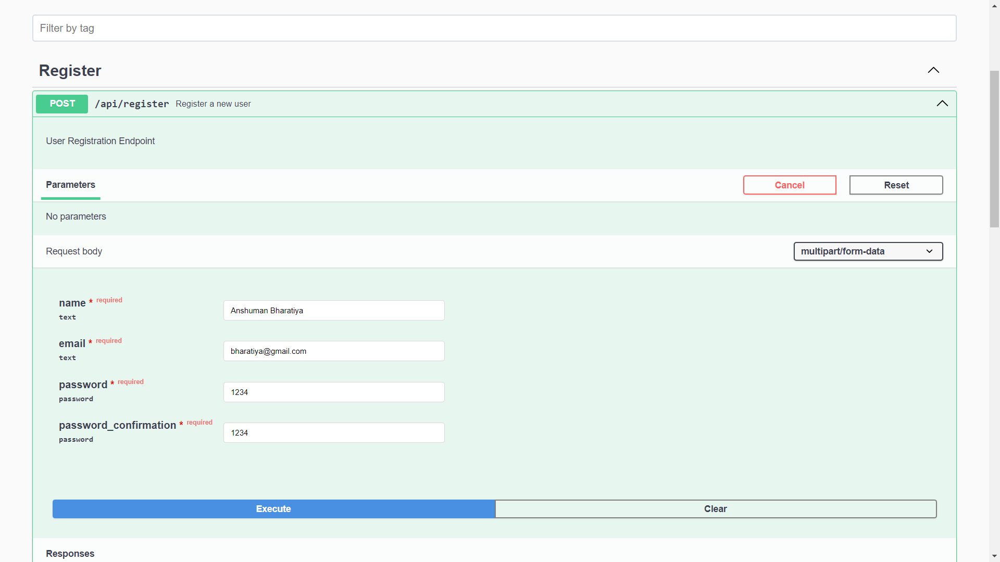
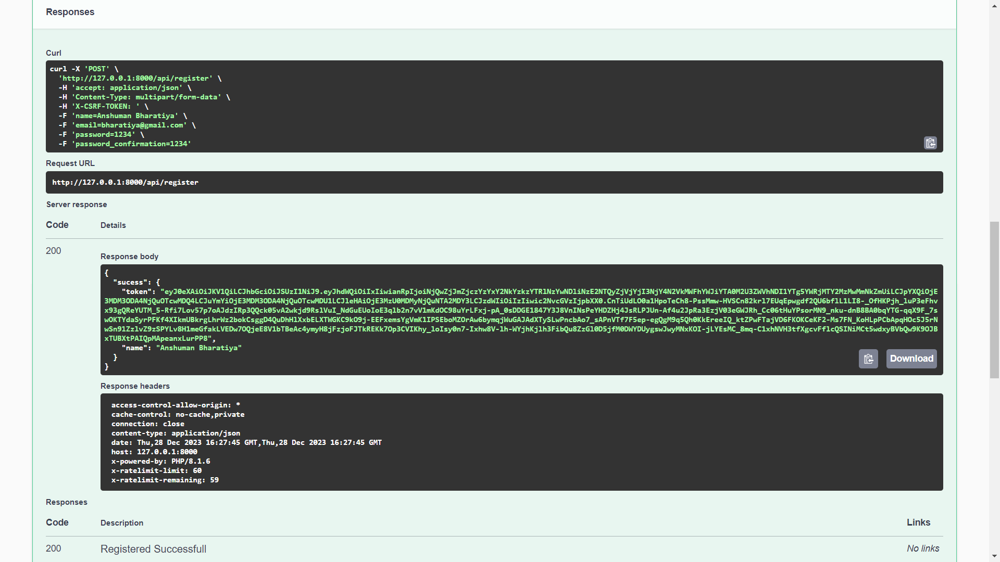
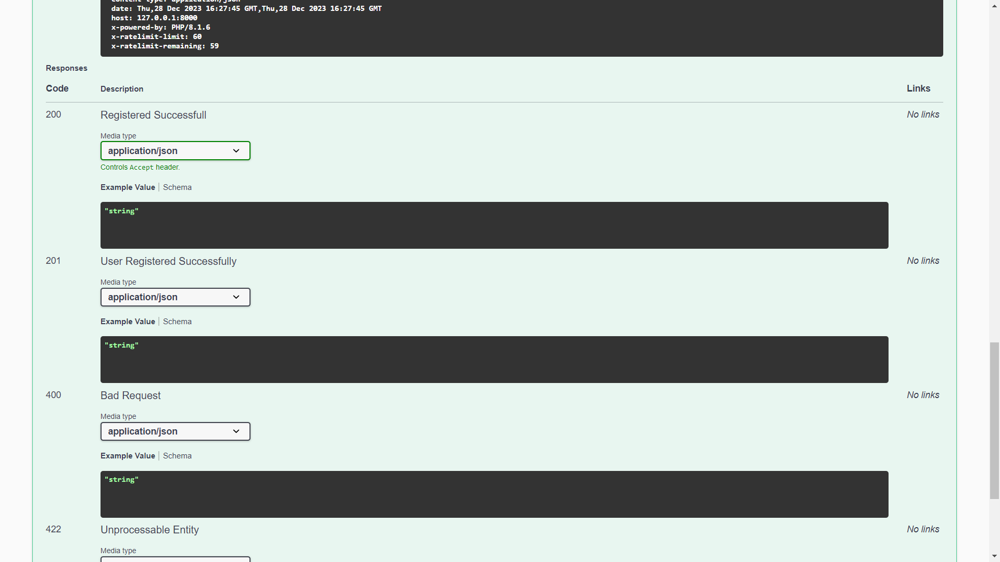

**Quick Summary:**

Leverage the power of Laravel and the Swagger tool with this comprehensive guide on Laravel Swagger Integration. Explore the step-by-step process of creating detailed REST API documentation effortlessly, ensuring seamless communication and understanding of your Laravel-based APIs.

# Introduction

Welcome to the world of Laravel Swagger Integration 2024! This guide will show you how to effortlessly combine Laravel, a powerful PHP framework, with Swagger, a user-friendly tool for API documentation.

Whether you're a seasoned developer or just starting out, this guide will walk you through the basics, highlight the perks of using Laravel and Swagger together, and provide a step-by-step roadmap for seamless integration. So, buckle up as we embark on a journey to enhance your Laravel development experience and make API documentation a piece of cake!

# What is Laravel?

<p align="center"><a href="https://laravel.com" target="_blank"></a></p>

Laravel is a powerful and elegant PHP web application framework that facilitates the development of robust and modern web applications. Known for its expressive syntax, developer-friendly features, and extensive ecosystem, Laravel simplifies common tasks and promotes best practices, making it a popular choice for web developers worldwide.

Whether you're building small projects or large-scale applications, Laravel provides a clean and enjoyable development experience. Its features include an expressive ORM (Eloquent), a robust routing system, middleware support, Blade templating engine, and seamless integration with tools like Composer for dependency management. [Read More About Laravel](https://laravel.com/docs/).

# What is Swagger?


<p class="text-center">[ <em> Swagger API DOCs UI </em> ] </p>

Swagger is a tool that acts like a helpful guide for developers in the realm of web development. It's akin to a well-organized manual that explains how to use web APIs in a clear and understandable manner. This tool ensures that developers and users can easily comprehend the ins and outs of an API—what data to send, where to send it, and what to expect in return. In simpler terms, Swagger streamlines the process of creating comprehensive API documentation, making it akin to a user-friendly map for navigating the landscape of web development. [Read More About Swagger](https://swagger.io/docs/)

# Advantages of Integrating Swagger with Laravel

Integrating Swagger with Laravel offers several advantages, enhancing the development and documentation process of web APIs. Here are some key benefits:

1. **Clear API Documentation:**

   Swagger provides a standardized and visually appealing way to document APIs. Integration with Laravel ensures that your API documentation is clear, concise, and easy to understand for both developers and API consumers.

2. **Interactive API Exploration:**

   Swagger generates an interactive API explorer, allowing developers to interact with and test API endpoints directly from the documentation. This feature simplifies the debugging process and accelerates API development.

3. **Automatic Documentation Updates:**

   With Laravel and Swagger integration, your API documentation is automatically updated as you modify your code. This reduces the likelihood of documentation becoming outdated, ensuring that developers always have accurate information.

4. **Consistent API Design:**

Swagger enforces consistency in API design by providing a standardized format for documenting endpoints, request parameters, and responses. This consistency is beneficial for maintaining a cohesive and well-structured API.

5. **Client Code Generation:**

   Swagger supports the generation of client code in various programming languages based on the API documentation. This feature streamlines the development process for API consumers, as they can generate code snippets tailored to their preferred language.

6. **Improved Collaboration:**

   Integration with Swagger enhances collaboration between development teams and stakeholders. Clear and updated documentation facilitates communication by providing a shared understanding of the API's functionality and usage.

7. **Testing and Validation:**

   Swagger allows developers to define and validate API request and response formats. This ensures that data is correctly formatted and reduces the likelihood of errors in API interactions.

8. **Enhanced Security:**

   Swagger documentation can include information about authentication and authorization mechanisms. This helps developers and security professionals understand and implement the necessary security measures for the API.

9. **Standardized OpenAPI Specification:**

   Swagger follows the OpenAPI Specification, a widely adopted industry standard for API documentation. This standardization promotes interoperability and allows for the integration of various tools and libraries that support the OpenAPI Specification.

10. **Time and Resource Efficiency:**

    Laravel Swagger integration reduces the time and resources required for manually creating and updating API documentation. This automation allows developers to focus more on coding and less on documentation maintenance.

# Requirements and Setup for Laravel Swagger

**_Requirements for Laravel Swagger Integration:_**

- [Laravel Framework](https://laravel.com/)
- [Composer](https://getcomposer.org/)
- Swagger/OpenAPI Specification
- Swagger UI Package (If not using Laravel Sanctum)
- Text Editor or IDE([Visual Studio Code](https://code.visualstudio.com/download), [Atom Editor](https://atom.en.lo4d.com/windows))etc.
- [XAMPP Tool](https://www.apachefriends.org/download.html)

**_Developer Should Know to Start Integrations_**

- Laravel Basics
- API Concepts
- Basic Composer Commands
- Swagger/OpenAPI Understanding
- Middleware in Laravel
- Command Line Proficiency
- Working with Laravel and Database

# Step-by-Step Guide for Laravel Swagger Integration.

Integrating Swagger with Laravel involves a few steps to generate API documentation for your Laravel application. Here's a step-by-step guide:

## 1. Install Laravel Project

```cmd
composer global require laravel/installer

laravel new laravel-swagger-api-docs
```

or

```cmd
composer create-project laravel/laravel laravel-swagger-api-docs
```

After the project has been created, start Laravel's local development server using the Laravel's Artisan CLI serve command:

```cmd
cd laravel-swagger-api-docs

php artisan serve

```

## 2. Database Configuration in laravel

Open the .env file in the root of your Laravel project. This file contains environment-specific configuration, including database settings. Set the following parameters:

```'':title=.env
DB_CONNECTION=mysql
DB_HOST=your_database_host
DB_PORT=your_database_port
DB_DATABASE=your_database_name
DB_USERNAME=your_database_username
DB_PASSWORD=your_database_password
```

**_Example:_**

```'':title=.env
DB_CONNECTION=mysql
DB_HOST=127.0.0.1
DB_PORT=3306
DB_DATABASE=example_l_swagger
DB_USERNAME=root
DB_PASSWORD=1234
```

To create a database for a Laravel project, you'll need a database management system (DBMS) and a local development environment. Laravel supports various database systems, but MySQL is commonly used. So Install XAMPP or any DBMS.

## 3. Install Laravel Passport and Configuration

Laravel Passport, which is a Laravel package for API authentication using OAuth2. The below command will download and install the Passport package and its dependencies.

```cmd
composer require laravel/passport

php artisan passport:install
```

After install Update _/config/database.php_ file below 2 lines.

```php:title=/config/database.php
'mysql' => [
    'charset' => 'utf8', // default value is 'utf8mb4'utf8mb4
    'collation' => 'utf8_unicode_ci', // default value is 'utf8mb4_unicode_ci'
]
```

**_php artisan migrate_** is a Laravel command that applies pending database migrations, creating or updating database tables based on defined schema changes in your application. Here, we are using the default migration file and its related table.

```cmd
php artisan migrate
```

Open your App\User model and make sure it implements the Laravel\Passport\HasApiTokens trait. In _\app\Models\User.php_ use **Passport** instend of **Sanctum** for HasApiTokens.

```php:title=/app/Models/User.php
use Laravel\Passport\HasApiTokens;

class User extends Authenticatable
{
    use HasApiTokens, HasFactory, Notifiable;
}
```

Update _config/auth.php_

```php:title=/config/auth.php
'guards' => [
        'web' => [
            'driver' => 'session',
            'provider' => 'users',
        ],
        'api' => [
            'driver' => 'passport',
            'provider' => 'users',
            'hash' => false,
        ],
    ],
```

## 4. Install Swagger Required Packages and it's Configuration

Install the necessary packages for Swagger integration:

```cmd
composer require "darkaonline/l5-swagger"
```

Publish the configuration file to customize Swagger settings:

```cmd
php artisan vendor:publish --provider "L5Swagger\L5SwaggerServiceProvider"
```

This will create a _config/l5-swagger.php_ file.

Configure _l5-swagger.php_. Open the generated _/config/l5-swagger.php_ file and uncomment the below line of code.

```php:title=/config/l5-swagger.php
/* Open API 3.0 support */
'passport' => [ // Unique name of security
    'type' => 'oauth2', // The type of the security scheme. Valid values are "basic", "apiKey" or "oauth2".
    'description' => 'Laravel passport oauth2 security.',
    'in' => 'header',
    'scheme' => 'https',
    'flows' => [
        "password" => [
            "authorizationUrl" => config('app.url') . '/oauth/authorize',
            "tokenUrl" => config('app.url') . '/oauth/token',
            "refreshUrl" => config('app.url') . '/token/refresh',
            "scopes" => []
        ],
    ],
],

```

## 5. Create Routes

```php:title=/routes/api.php
use App\Http\Controllers\Api\AuthController;

Route::post('login', [AuthController::class, 'login']);
Route::post('register', [AuthController::class, 'register']);
```

## 6. Create User Registration and Login Controller

```cmd
php artisan make:controller Api/AuthController
```

## 7. Implement User Registration and Login Logic.

```php:title=/app/Http/Controllers/Api/AuthController.php
<?php

    namespace App\Http\Controllers\Api;

    use App\Http\Controllers\Controller;
    use Illuminate\Http\Request;
    use Hash;
    use App\Models\User;

    class AuthController extends Controller
    {
        /**
        * @OA\Post(
        *     path="/api/register",
        *     operationId="registerUser",
        *     tags={"Register"},
        *     summary="Register a new user",
        *     description="User Registration Endpoint",
        *     @OA\RequestBody(
        *         @OA\JsonContent(),
        *         @OA\MediaType(
        *             mediaType="multipart/form-data",
        *             @OA\Schema(
        *                 type="object",
        *                 required={"name","email","password","password_confirmation"},
        *                 @OA\Property(property="name",type="text"),
        *                 @OA\Property(property="email",type="text"),
        *                 @OA\Property(property="password",type="password"),
        *                 @OA\Property(property="password_confirmation",type="password"),
        *             ),
        *         ),
        *     ),
        *     @OA\Response(
        *         response="201",
        *         description="User Registered Successfully",
        *         @OA\JsonContent()
        *     ),
        *     @OA\Response(
        *       response="200",
        *       description="Registered Successfull",
        *       @OA\JsonContent()
        *     ),
        *     @OA\Response(
        *         response="422",
        *         description="Unprocessable Entity",
        *         @OA\JsonContent()
        *     ),
        *     @OA\Response(
        *         response="400",
        *         description="Bad Request",
        *         @OA\JsonContent()
        *     ),
        * )
        */


        public function register(Request $request){
            $validated = $request->validate(
                [
                    'name' => 'required',
                    'email' => 'required|email|unique:users',
                    'password' => 'required|confirmed'
                ]
            );
            $data = $request->all();
            $data['password']=Hash::make($data['password']);
            $user = User::create($data);
            $sucess['token'] = $user->createToken('authToken')->accessToken;
            $sucess['name'] = $user->name;
            return response()->json(['sucess'=>$sucess]);
        }

        //  Login API
        /**
        * @OA\Post(
        *     path="/api/login",
        *     operationId="loginUser",
        *     tags={"Login"},
        *     summary="Login a user",
        *     description="User Login Endpoint",
        *     @OA\RequestBody(
        *         @OA\JsonContent(),
        *         @OA\MediaType(
        *             mediaType="multipart/form-data",
        *             @OA\Schema(
        *                 type="object",
        *                 required={"email","password"},
        *                 @OA\Property(property="email",type="text"),
        *                 @OA\Property(property="password",type="password"),
        *             ),
        *         ),
        *     ),
        *     @OA\Response(
        *         response="201",
        *         description="User Login Successfully",
        *         @OA\JsonContent()
        *     ),
        *     @OA\Response(
        *       response="200",
        *       description="Login Successfull",
        *       @OA\JsonContent()
        *     ),
        *     @OA\Response(
        *         response="422",
        *         description="Unprocessable Entity",
        *         @OA\JsonContent()
        *     ),
        *     @OA\Response(
        *         response="400",
        *         description="Bad Request",
        *         @OA\JsonContent()
        *     ),
        * )
        */

        public function login(Request $request){
            $validated = $request->validate(
                [
                    'email' => 'required|email',
                    'password' => 'required'
                ]
            );
            if(!auth()->attempt($validated)){
                    return response()->json(["error" => "Unauthorised"], 401);
            }else{
                $sucess['token'] = auth()->user()->createToken('authToken')->accessToken;
                $sucess['user'] = auth()->user();

                return response()->json(["success" => $sucess], 200);
            }
        }

    }
```

## 8. Update Version in \app\Http\Controllers\Controller.php file

```php:title=/app/Http/Controllers/Controller.php
<?php
    namespace App\Http\Controllers;

    use Illuminate\Foundation\Auth\Access\AuthorizesRequests;
    use Illuminate\Foundation\Validation\ValidatesRequests;
    use Illuminate\Routing\Controller as BaseController;

    /**
    * @OA\Info(
    *    title="Swagger with Laravel",
    *    version="1.0.0",
    * )
    */
    class Controller extends BaseController
    {
        use AuthorizesRequests, ValidatesRequests;
    }
```

## 9. Generate Swagger Documentation:

Generate Swagger documentation by running below command:

```cmd
php artisan l5-swagger:generate
```

## 10. Run The Laravel Application and Access the Documentation

Start the Laravel development server by running the command:

```cmd
php artisan serve
```

Open your browser and navigate to the following address: `http://127.0.0.1:8000/`

To access the API documentation, go to: `http://127.0.0.1:8000/api/documentation`



<p class="text-center">[ <em> Swagger API DOCs Image-1 </em> ] </p>



<p class="text-center">[ <em> Swagger API DOCs Image-2 </em> ] </p>



<p class="text-center">[ <em> Swagger API DOCs Image-3 </em> ] </p>

> Notes:

These commands clear specific Laravel caches:

```cmd
php artisan cache:clear: Clears the application cache.
php artisan route:clear: Clears the route cache.
php artisan config:clear: Clears the configuration cache.
```

## Click Here for [Source Code](https://github.com/AnshumanBharatiya/laravel-swagger-api-docs "GitHub")

# Conclusion

In the realm of web development, the fusion of Laravel with Swagger in 2024 emerges as a game-changer. This integration streamlines API documentation, fostering clarity and collaboration. Developers benefit from an interactive API explorer and standardized design practices, optimizing efficiency. As we navigate the dynamic landscape, Laravel Swagger Integration stands as a beacon of seamless development, where communication is clear, and innovation thrives. Here's to a future of efficient, collaborative, and well-documented APIs. Happy coding!

<br>

**_Posted By ~ Anshuman Bharatiya on Monday, 1st January 2024_**

**_If you like this post, feel free to share it._**

**_Thank You_**
